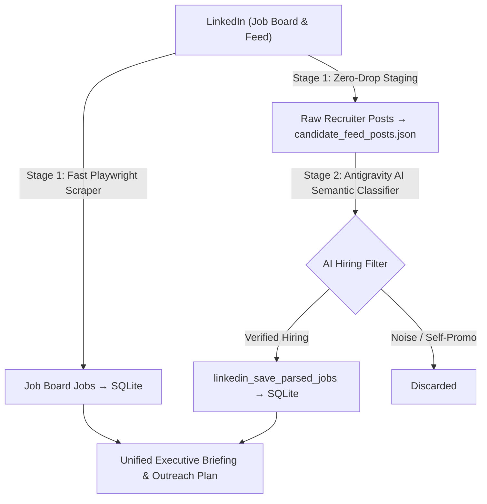

# LinkedIn MCP Server

A Python-based [Model Context Protocol (MCP)](https://modelcontextprotocol.io/) server for LinkedIn integration, built for **Google Antigravity (`agy`)** and compatible with Claude Code.

Installed once, it is available **system-wide** across any project directory on your machine.

---

## Features

- **Global Availability:** Registers into `~/.gemini/config/mcp_config.json` (and optionally `~/.claude.json`).
- **Live Local Development:** Installed in editable mode (`pip install -e .`). Code changes you make in this repository are immediately active without reinstalling.
- **Built-in Tools:**
  - `linkedin_status`: Diagnostic check of MCP connection, API credentials, browser session, and daily safety stats.
  - `linkedin_search_feed_posts`: Live search for posts by keywords with date/sort filters and computed engagement scores (reactions & comments).
  - `linkedin_comment_on_post`: Post insightful comments to LinkedIn posts with built-in daily safety limits.
  - `linkedin_search_people`: Find targeted leads, hiring managers, recruiters, or peers.
  - `linkedin_send_connect_request`: Send connection requests with custom personalized notes (up to 300 chars).
  - `linkedin_get_safety_stats`: View daily remaining quota for comments and connection invites.
  - `linkedin_search_jobs`: Search the official LinkedIn Job Board by keywords, location (e.g. 'Pune'), workplace type ('remote', 'hybrid', 'onsite'), experience level, and date posted, with pagination support.
  - `linkedin_get_job_details`: Fetch full job descriptions, role requirements, and hiring details by job ID or URL.
  - `linkedin_save_parsed_jobs`: Validate and bulk-upsert parsed openings into local SQLite database with deterministic deduplication.
  - `linkedin_query_stored_jobs`: Query and filter stored openings from local SQLite by skills, location, or date with zero network calls.
  - `linkedin_get_db_stats`: Analytical statistics on stored jobs, top in-demand skills, and latest sync history.
  - `linkedin_get_profile`: Fetch profile details by member ID or `me`.
  - `linkedin_create_post`: Publish or draft text posts with visibility control.

---

## Installation (Clone & Run Anywhere)

To install this on any machine:

```bash
# 1. Clone the repository
git clone https://github.com/DeepLearner7/linkedin-mcp.git
cd linkedin-mcp

# 2. Run the automated installer
./install.sh
```

The installer will:
1. Create a isolated `.venv` virtual environment.
2. Install all dependencies and the package in editable mode.
3. Automatically register the server globally in `~/.gemini/config/mcp_config.json`.
4. Create a local `.env` file from `.env.example`.

### Also Enable for Claude Code CLI

If you also use Claude Code CLI, pass the `--claude` flag:

```bash
./install.sh --claude
```

---

## Authentication & Setup

### 1. Browser Session Authentication (For Post Search, Comments & Connect Requests)

To search public posts, interact, and send connection requests, LinkedIn requires a logged-in browser session. Run the interactive login helper:

```bash
./.venv/bin/python login.py
# (Or: python3 login.py — auto-detects and uses the .venv interpreter)
```

This will launch a visible Chromium window:
1. Log into your LinkedIn account normally.
2. Complete 2FA or CAPTCHA if prompted.
3. Once you reach the feed, the session is captured automatically and saved to `~/.config/linkedin-mcp/session.json`.

*(Alternatively, you can set `LINKEDIN_LI_AT_COOKIE=your_cookie` in `.env` if you prefer).*

### 2. LinkedIn REST API (Optional, for Publishing Posts directly)

Add your LinkedIn OAuth2 Access Token to `.env`:

```bash
LINKEDIN_ACCESS_TOKEN=your_oauth_token_here
```

Tokens can be created from the [LinkedIn Developer Portal](https://www.linkedin.com/developers/).

The server checks for `.env` in:
1. Current working directory
2. The `linkedin-mcp` repository root
3. `~/.config/linkedin-mcp/.env`
4. Direct environment variable (`export LINKEDIN_ACCESS_TOKEN=...`)

---

## Using with Antigravity (`agy`)

1. Open a terminal in **any** folder on your computer and start `agy`:
   ```bash
   agy
   ```
2. Type `/mcp` to verify:
   - You will see `linkedin` listed under active MCP servers with its tools.
3. Ask the agent directly:
    - *"Check linkedin_status to see if my connection is working."*
    - *"Fetch my linkedin profile details."*
    - *"Draft and post a LinkedIn update announcing our new MCP server."*
    - *"Sync recent Senior Data Engineer, Senior Data Platform Engineer, and Data Engineering Lead openings in Pune and Bangalore to the database."*
    - *"Query stored jobs from the database that require Spark and Kafka."*

---

## Daily Job Scraping & Database Storage

The system includes a daily scraping, deterministic schema extraction, and SQLite database storage pipeline for job board openings and recruiter feed posts. All data and sessions are stored centrally in `~/.config/linkedin-mcp/`, meaning you can run commands from **any directory** on your machine.

---

### Architecture: 2-Stage Hybrid Pipeline

To ensure **blazing speed (< 1.5 minutes)** without timeouts while maintaining **high-precision AI intelligence**, the daily sync uses a two-stage decoupled architecture:



1. **Stage 1 (High-Recall Scraper - Fast & Deterministic):**
   * Executes Boolean `OR` queries across target roles (`Senior Data Engineer`, `Senior Data Platform Engineer`, `Data Engineering Lead`) in `Pune` and `Bangalore` for the past 7 days (`past-week`).
   * Fetches Job Board cards and bulk-upserts them directly into SQLite (`~/.config/linkedin-mcp/jobs.db`).
   * Auto-expands `...see more` on LinkedIn recruiter posts and stages **all** raw candidate posts into `~/.config/linkedin-mcp/candidate_feed_posts.json` without discarding anything via regex.
2. **Stage 2 (High-Precision AI Semantic Classification & Briefing):**
   * Antigravity AI (`agy`) reads `candidate_feed_posts.json` and uses LLM semantic reasoning to evaluate every recruiter post:
     * Validates whether the author is actively hiring for a Senior Data Engineering / Platform / Lead role.
     * Filters out non-hiring noise (job seekers `#opentowork`, celebratory announcements, course marketing, opinion pieces).
     * Extracts structured metadata (title, company, tech stack, recruiter contact email).
     * Calls `linkedin_save_parsed_jobs` to commit verified recruiter openings to SQLite.
   * Generates a consolidated Executive Briefing uniting Job Board openings and AI-verified recruiter leads.

---

### 1. Automated Daily Background Scheduling

The automated daily runner executes both Stage 1 and Stage 2 every morning.

#### Method A: 1-Command Crontab Setup (Runs daily at 9:00 AM)
```bash
./scripts/setup_cron.sh --install
```
To verify or inspect the crontab entry:
```bash
crontab -l
# 0 9 * * * /path/to/linkedin-mcp/scripts/daily_sync.sh
```

#### Method B: macOS `launchd` (Recommended for MacBooks that sleep)
Standard `cron` may skip scheduled runs if your laptop lid is closed at 9:00 AM. A macOS `launchd` LaunchAgent catches up and runs automatically as soon as your Mac wakes up:

```bash
# 1. Create the LaunchAgent (run from the repository directory)
cat << EOF > ~/Library/LaunchAgents/com.linkedin.mcp.sync.plist
<?xml version="1.0" encoding="UTF-8"?>
<!DOCTYPE plist PUBLIC "-//Apple//DTD PLIST 1.0//EN" "http://www.apple.com/DTDs/PropertyList-1.0.dtd">
<plist version="1.0">
<dict>
    <key>Label</key>
    <string>com.linkedin.mcp.sync</string>
    <key>ProgramArguments</key>
    <array>
        <string>/bin/bash</string>
        <string>${PWD}/scripts/daily_sync.sh</string>
    </array>
    <key>StartCalendarInterval</key>
    <dict>
        <key>Hour</key>
        <integer>9</integer>
        <key>Minute</key>
        <integer>0</integer>
    </dict>
    <key>StandardOutPath</key>
    <string>${HOME}/.config/linkedin-mcp/sync.log</string>
    <key>StandardErrorPath</key>
    <string>${HOME}/.config/linkedin-mcp/sync.log</string>
</dict>
</plist>
EOF

# 2. Load the agent
launchctl load ~/Library/LaunchAgents/com.linkedin.mcp.sync.plist
```

#### Monitoring Background Logs:
```bash
tail -f ~/.config/linkedin-mcp/sync.log
```

---

### 2. Manual On-Demand Execution (Run from ANY directory)

#### End-to-End Daily Sync (Scrape + AI Executive Briefing):
```bash
./scripts/daily_sync.sh
```

#### Scraper Only via Global CLI (`linkedin-jobs`):
```bash
# Sync all jobs across default roles in Pune & Bangalore for the past 7 days:
linkedin-jobs

# Or customize keywords, locations, limits, and export formats:
linkedin-jobs --keywords "Senior Data Engineer, Senior Data Platform Engineer, Data Engineering Lead" --location "Pune, Bangalore" --date-posted past-week --limit 50 --export markdown --output weekly_report.md
```

#### AI Executive Briefing Only:
```bash
# Generate daily executive briefing from the latest local sync report:
agy -p "Analyze the latest LinkedIn job sync results stored in ~/.config/linkedin-mcp/latest_sync_report.md and generate an executive briefing." --dangerously-skip-permissions
```

---

### 3. Instant Local Querying (Zero Network Calls, from ANY directory)

```bash
# Query stored openings by required skills
linkedin-jobs --skills "Spark, Kafka"

# Query by company or keyword
linkedin-jobs --query "Mastercard"

# View storage analytics and top in-demand skills
linkedin-jobs --stats
```

---

### 4. Viewing Data in DBeaver / SQLite Viewers

The centralized database is stored at:
```text
~/.config/linkedin-mcp/jobs.db
```

* **DBeaver**: Click **New Connection** > **SQLite** > set Path to your **full absolute path** (DBeaver does not expand `~`):
  * Path: `/Users/<your-username>/.config/linkedin-mcp/jobs.db` (e.g. `/Users/saurabh8141/.config/linkedin-mcp/jobs.db`)
  * Alternatively, click **Browse...** (in macOS Finder dialog, press `Cmd + Shift + G` and paste the path, or `Cmd + Shift + .` to reveal hidden `.` folders).
* **Tables available**:
  * `jobs`: Complete normalized job records, company, title, workplace type, and apply URLs.
  * `job_skills`: Relational table indexed for skill lookups (e.g. all jobs requiring *Databricks*).
  * `sync_runs`: Audit history of each scrape run.
* **No Database Locking**: Configured with **SQLite WAL mode**, allowing simultaneous querying in DBeaver while background syncs write new jobs.

## Local Development & Adding Tools

Because the package is installed in editable mode (`pip install -e .`), any edits you make to `src/linkedin_mcp/server.py` are live immediately:

1. Open `src/linkedin_mcp/server.py`.
2. Add a new tool decorated with `@app.tool()`:

```python
@app.tool()
def linkedin_get_connections_count() -> str:
    """Return the total number of LinkedIn connections."""
    return "You have 500+ connections."
```

3. Save the file. The next time an agent runs, the new tool is automatically discovered!

> **Important**: Never use `print()` for debugging inside server code; it writes to `stdout` and breaks the stdio JSON-RPC stream. Use `logger.info()` instead, which writes safely to `stderr`.

---

## Web Dashboard & "Ask AI" Career Copilot

Launch the local web dashboard with a single command:

```bash
linkedin-ui
```
*(or `python -m linkedin_mcp.ui.server`)*

Open your browser at **http://127.0.0.1:8000**:

1. **Jobs Discovery Hub**:
   - Live metrics (Total Stored, Recruiter Leads, Job Board Openings, In-Demand Skills).
   - Instant search & filtering (keywords, location, workplace model: hybrid/remote/onsite, source).
   - Toggle between **Cards View** and **Table View**.
   - Direct recruiter leads with profile links and contact emails.
   - 1-Click **"⚡ Sync Now"** button with live background progress drawer.

2. **"Ask AI" Career Copilot**:
   - Grounded directly on your local SQLite database (`jobs.db`) with zero hallucination.
   - **Target Context Selector**: Focus on an individual job or query across the entire database.
   - **1-Click Superpowers**:
     - ✉️ **Draft Recruiter Outreach**: Generates a 300-char LinkedIn connection note and cold email.
     - ⚡ **Resume Fit & Gap Analysis**: Calculates match score, matching skills, and missing keywords.
     - 🎯 **5 Technical Interview Questions**: Architecture & system design questions tailored to the JD.
     - 📊 **In-Demand Tech Trends**: Market overview of Pune & Bangalore data engineering requirements.

3. **Settings & Profile**:
   - Add your free **Google Gemini API Key** (or use local **Ollama**).
   - Customize your resume summary and core skills so the Copilot always personalizes responses to your experience.

---

## Uninstallation (1-Command Cleanup)

To completely uninstall everything (Antigravity & Claude registrations, global CLI symlinks, crontab schedules, `.venv`, and database):

```bash
# Clean uninstall (preserves session.json so you don't have to re-login next time):
./uninstall.sh

# Or full purge (including LinkedIn session):
./uninstall.sh --purge-all
```

